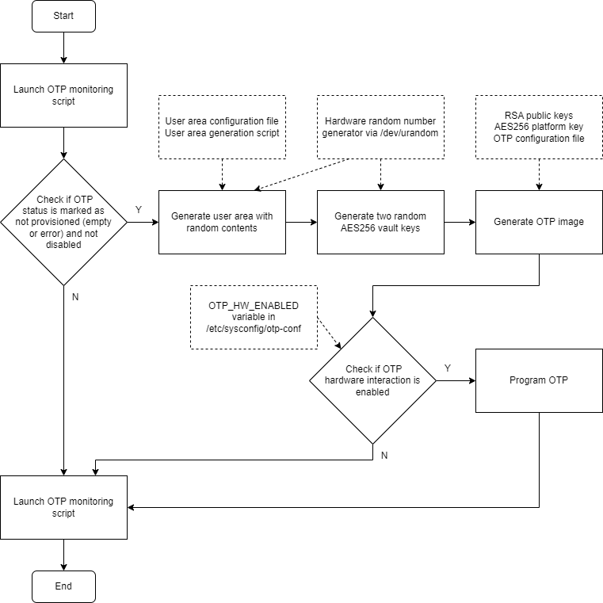
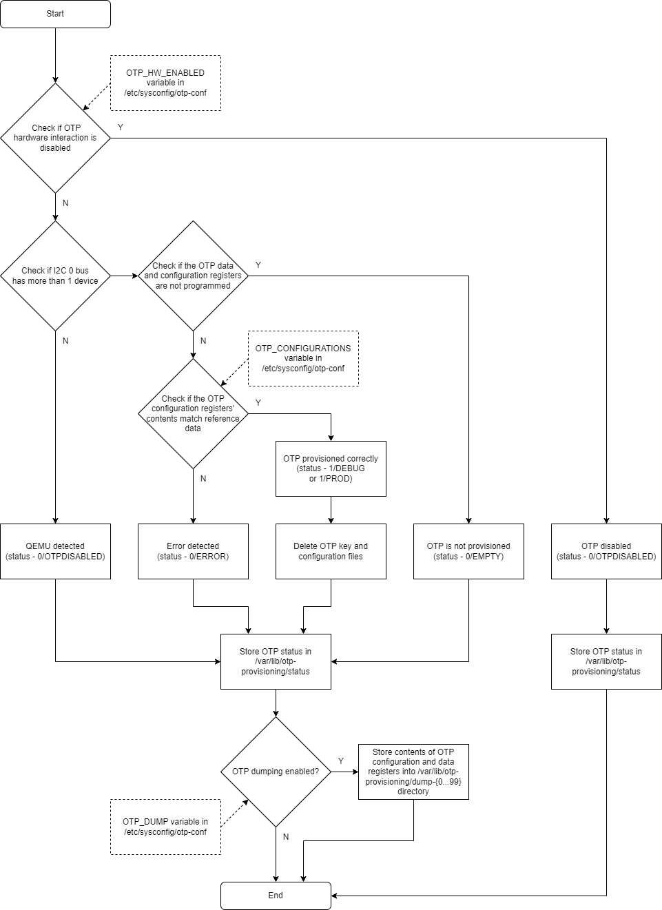

# OTP provisioning / AST2600 Secure Boot

Author:
Piotr Juda <pjuda@nvidia.com>

Created: 2024-03-14

# High level architecture / Key technical items

* Platform image - OpenBMC image built without `otp-provisioning` added to the
`DISTRO_FEATURES` build variable; does not contain the OTP provisioning scripts
and systemd service
* Provisioning image - OpenBMC image built with `otp-provisioning` added to the
`DISTRO_FEATURES` build variable; contains the OTP provisioning scripts and
systemd service; most likely used only in a production setting
* u-boot-spl - u-boot Secondary Program Loader - binary placed at the beginning
of OpenBMC image, used for the first stage of booting up the system; if OTP
memory is provisioned and secure boot is enabled, AST2600 uses RSA public keys
stored in the OTP memory to verify the validity of u-boot-spl's signature, then
decrypts the binary using the AES256 platform key (if the feature is enabled in
secure boot configuration); if the signature is invalid and/or the binary is
encrypted with an incorrect key, the booting process is stopped and the chip
sends out an error code over the UART interface - see AST2600 Secure Boot User
Guide for more details. The u-boot-spl binary can be signed during the Yocto
build of the image, or a precompiled and presigned binary can be used - more
details can be found in a dedicated section of this document.
* RSA signature keys - a set of up to 8 private/public key pairs used to
generate and verify the signature of the u-boot-spl binary. The public keys are
used in the process of OTP provisioning and are stored in the OTP memory of the
AST2600 chip. The keys are placed in the secure area of the OTP memory, and as a
result cannot be read after secure boot is enabled. 
Key 0 is treated as a low-security key and is unused in the current
implementation. Each of the public keys can be revoked by programming relevant
registers of the OTP, this process is independent of the OTP provisioning done
in the factory setting. In a development setting, the private keys can be stored
as part of the OpenBMC repository, and then used to sign the u-boot-spl binary
during each build. The private keys can also be stored in the 3S server and used
to sign a pre-compiled u-boot-spl binary, which can then be placed in the
OpenBMC repository. For systems, where only one OTP configuration and one set of
keys is used, development images may use an u-boot-spl binary signed with key
number 1, which may later get revoked by software before the system gets
delivered to a client. 
More details about the placement of private and public keys inside the OpenBMC
project tree can be found in a dedicated section of this document.
* AES platform key - a 256-bit key used to encrypt and decrypt the u-boot-spl
binary. For systems, which utilize OpenBMC Yocto image to provision OTP,
a placeholder key generated on the 3S server and placed in the OpenBMC project
is used, however it has no functional value. For this feature to be enabled, the
socsec-sign class would need to be modified to enable encryption (see OpenBMC
merge request 3607). This key is not used for any other functionality.
* AES vault keys - two 256-bit keys generated on the provisioned BMC system
using AST2600's hardware random number generator. They are programmed into the
chip's secure area and are not directly accessible. Can be used to decrypt and
encrypt data by using the kernel's crypto driver with "dummy" keys specified in
kernel's device tree. At the time of writing, the vault keys were not used for
any functionality.
* OTP configuration - JSON file used during creation of the OTP image, contains
settings related to AST2600's security features - see AST2600 Secure Boot User
Guide for more details.

# Low-level design

## OTP provisioning systemd service

The OTP image generation is done in runtime on the target system. The OTP
provisioning service uses the OTP monitoring script to detect if OTP was
already provisioned. If not, it uses key and configuration files generated
during the build, as well as locally generated AES-256 vault keys, to create
the OTP image by utilizing socsec application. It then uses the otp application
to program the OTP with the created image. The final step is another execution
of the monitoring script, which verifies if the provisioning was successful.  

## OTP monitoring systemd service

The OTP monitoring service is based on one-time execution of otp-monitor.sh
script. Its functionalities consist of QEMU detection, where the number of
devices present on the I2C 0 bus is used to determine if the script is executed
on physical hardware (2 more or devices detected), or in a QEMU setting. If QEMU
is detected, the script stores *OTPDISABLED* as the OTP status in the
appropriate file (*/var/lib/otp-provisioning/status*) and exits, in order to
avoid using the OTP driver, where any interaction done in the QEMU setting would
result in kernel panic. If the script is executed on a physical device, it reads
the contents of the OTP configuration and data areas and proceeds with further
analysis. If both areas are empty, status *EMPTY* is stored. If the data section
is not empty, the configuration data is compared with values stored in the
*OTP_CONFIGURATIONS* environment variable. If a matching setting is found, the
corresponding label (*PROD* or *DEBUG*) is saved in the status file. If no match
is found, the OTP status is set to *ERROR*. In the last step, the value of the
environment variable *OTP_DUMP* is used to determine whether a dump of OTP
configuration and data registers should be made. The dumps are placed in the
*/var/lib/otp-provisioning provisioning* directory, for each dump a new numbered
directory is created - *dump_00* to *dump_99*.  

# Related Redfish APIs

## Provisioning status

`/redfish/v1/Managers/<BMC_ID>/Oem/Nvidia/OTPProvisioned` (boolean) indicates if
the system’s OTP is correctly provisioned

## Build type

`/redfish/v1/Managers/<BMC_ID>/Oem/Nvidia/FirmwareBuildType` (string) contains
information about the image’s build type and whether the image is a provisioning
image or a platform image

# Enablement

## OpenBMC / Yocto

### u-boot-spl

In order to enable signing of the u-boot-spl binary during OpenBMC build, the
`SOCSEC_SIGN_ENABLE` build variable needs to be set to `1`. Setting it to `0`
disables the process. This can be made conditional based on the build type of
the image. If signing is enabled, also the `SOCSEC_SIGN_KEY` variable needs to
be specified and set to the name of the PEM file containing the private key used
to sign the binary. This key needs to match one of the public keys programmed
into OTP during the provisioning process. 
To use a precompiled and a presigned u-boot-spl binary, an unsigned binary
should be obtained by building the image with OTP provisioning enabled by
adding `DISTRO_FEATURES += "otp-provisioning"` to the build configuration. The
console log of the build will contain the path of the unsigned u-boot-spl
binary, the message should contain `Unsigned u-boot-spl binary path:` phrase.
This binary should then be passed to the 3S team to obtain a signed version.
In order for the static image to be included in the build, the deploy phase of
the u-boot package needs to be modified, see meta-nvidia/meta-hgx/recipes-bsp/
u-boot/u-boot-aspeed-sdk_%.bbappend as an example.  

Related files / directories in meta-nvidia (example):
- meta-xxx
  - recipes-bsp
    - u-boot
      - u-boot-aspeed-sdk_%.bbappend
      - files
        - spl-images
          - xxx.pem - private RSA key used to sign the u-boot-spl binary
          - prod
            - u-boot-spl.bin - precompiled / presigned u-boot-spl binary

### Provisioning image

#### OTP provisioning Yocto package and systemd service

The otp-provisioning service is enabled by including *nvidia-otp-provisioning*
as a runtime package and by adding *otp-provisioning* to the *DISTRO_FEATURES*
Yocto build variable. 
The suggested way of enabling provisioning is to add the following line to
meta-xxx/recipes-phosphor/images/obmc-phosphor-image.bbappend 
`OBMC_IMAGE_EXTRA_INSTALL += "${@bb.utils.contains('DISTRO_FEATURES',
'otp-provisioning', 'nvidia-otp-provisioning', '', d)}"` 
and the following line to one of the Yocto build configuration files (e.g.
local.conf) 
`DISTRO_FEATURES += "otp-provisioning"`

#### ROFS size adjustment

The *nvidia-otp-provisioning* package depends on several Python libraries and
the parser getting also being included in the image. As a consequence of this,
the size of the newly generated ROFS part of the image may exceed the previously
set ROFS partition size. The related settings are present in the machine
configuration file in the meta-nvidia/meta-<platform>/conf directory.
The following code would result with a ROFS partition size of 32768 KB
(43008 - 10240) for the platform image, and a ROFS partition size of 44032 KB
(54272 - 10240) for the provisioning image. 
`FLASH_ROFS_OFFSET = "10240"`
`FLASH_RWFS_OFFSET:flash-65536 = "${@bb.utils.contains('DISTRO_FEATURES',
'otp-provisioning', '54272', '43008', d)}"` 
These settings need to be reflected in the Linux kernel device tree file,
the description of the changes can be found in the relevant section of this
document. 
If the situation permits, the ROFS partition size can be the same for both
platform and provisioning image, with the caveat that a part of the ROFS
may remain unused in the platform image.

### Platform image

#### OTP monitor Yocto package and systemd service

The *otp-monitor* service is enabled by including *nvidia-otp-monitor* as
a runtime package. It can be added to images of both types, as, if both services
are enabled, the *otp-provisioning* systemd service’s presence blocks the
*otp-monitor* service from being started. The suggested way of adding the
*otp-monitor* service is to add the following line to
meta-xxx/recipes-phosphor/images/obmc-phosphor-image.bbappend 
`OBMC_IMAGE_EXTRA_INSTALL += "nvidia-otp-monitor"`

### All images

#### RSA and AES keys

For the OTP provisioning to be successfully executed, the user needs to equip
the Yocto build with public RSA keys used to verify the signature of the
u-boot-spl binary, an AES-256 key for u-boot-spl binary encryption (included in
the image but unused at this time) as well as the OTP configuration files. 
The RSA keys are named *oem_dss_4096_pub_{0...7}.pem*, eight keys need to be
included for the image creation to be executed correctly. The keys should be
placed in the module's working directory, in *keys/<key_type>/* directory. 
The *<key_type>* specifier is derived from the build type of the entire Yocto
image. If the user does not explicitly set the value of the Yocto `OTP_KEY_TYPE`
build variable, the key type is set to *prod* for *prod* images, and to *debug*
for other image types (currently *dev* and *debug*).  
The AES-256 key file should be named *aes_key.bin* and should be placed in the
same directory as the RSA public keys. The u-boot-spl binary encryption is not
enabled and the key is used as a placeholder, however the key file’s presence is
mandatory. 

Related files / directories in meta-nvidia (example):
- meta-xxx
  - recipes-nvidia
    - nvidia-otp-provisioning
      - files
        - keys
          - debug
            - aes_key.bin
            - oem_dss_4096_pub_{0…7}.pem
          - prod
            - aes_key.bin
            - oem_dss_4096_pub_{0…7}.pem

#### OTP configuration

The configuration files consist of *otp_config_<key_type>.json* and
*user_area_conf_<key_type>.yaml* files. The json file is directly consumed by
the *socsec* application and contains values placed into OTP configuration
registers. The yaml file is used by a helper script to generate contents of
a memory section with user-specified data. Currently the user area data is
unused, the configuration files and the helper script are only used as
a placeholder, however the configuration file’s presence is mandatory.
The *<key_type>* specifier is derived from the build type of the entire Yocto
image. If the user does not explicitly set the value of the Yocto *OTP_KEY_TYPE*
build variable, the key type is set to *prod* for *prod* images, and to *debug* for
other image types (currently *dev* and *debug*). 
For each of the key / configuration types, a simplified OTP image is created
during the Yocto build. The contents of the configuration registers stored in
the created image are then stored in the *OTP_CONFIGURATIONS* environment
variable in the `/etc/sysconfig/otp-conf` file. This data is then used by the
monitoring script for key / configuration type detection.  

Related files / directories in meta-nvidia:
- meta-xxx
  - recipes-nvidia
    - nvidia-otp-provisioning
      - files
        - nvidia-otp-provisioning.bbappend
        - conf
          - debug
            - otp_config_debug.json
            - user_area_conf_debug.yaml
          - prod
              - otp_config_prod.json
              - user_area_conf_prod.yaml
          - XXX
              - otp_config_XXX.json
              - user_area_conf_XXX.yaml

### Linux kernel

#### Kernel configuration

Following configuration entries are required to enable the Aspeed OTP kernel
driver: 
`CONFIG_ARCH_MULTI_V7=y` 
`CONFIG_MACH_ASPEED_G6=y` 
`CONFIG_ASPEED_OTP=y` 
Following entries enable usage of Aspeed’s hardware random number generator,
which is used to improve the randomness of keys created during OTP image
creation: 
`CONFIG_HW_RANDOM=y` 
`CONFIG_HW_RANDOM_ASPEED=y`

#### Device tree

The following device tree entry needs to be present to allow the usage of Aspeed
OTP kernel driver: 
`otp: otp@1e6f2000 {` 
`    compatible = "aspeed,ast2600-otp";` 
`    reg = <0x1e6f2000 0x940>;` 
`    aspeed,scu = <&syscon>;` 
`};`

In case the ROFS partition size needed to be modified in the Yocto machine
configuration, a corresponding change needs to be included in the device tree
flash layout configuration file. The change should affect the rofs@<offset>
section, with the `reg` setting containing the offset and size of the partition.
An example entry of `reg = <0xa00000 0x2C00000>;` will result in a ROFS
partition starting an offset of 10485760 bytes (0xa00000), with its size set to
46137344 bytes / 44 megabytes (0x2C00000).
